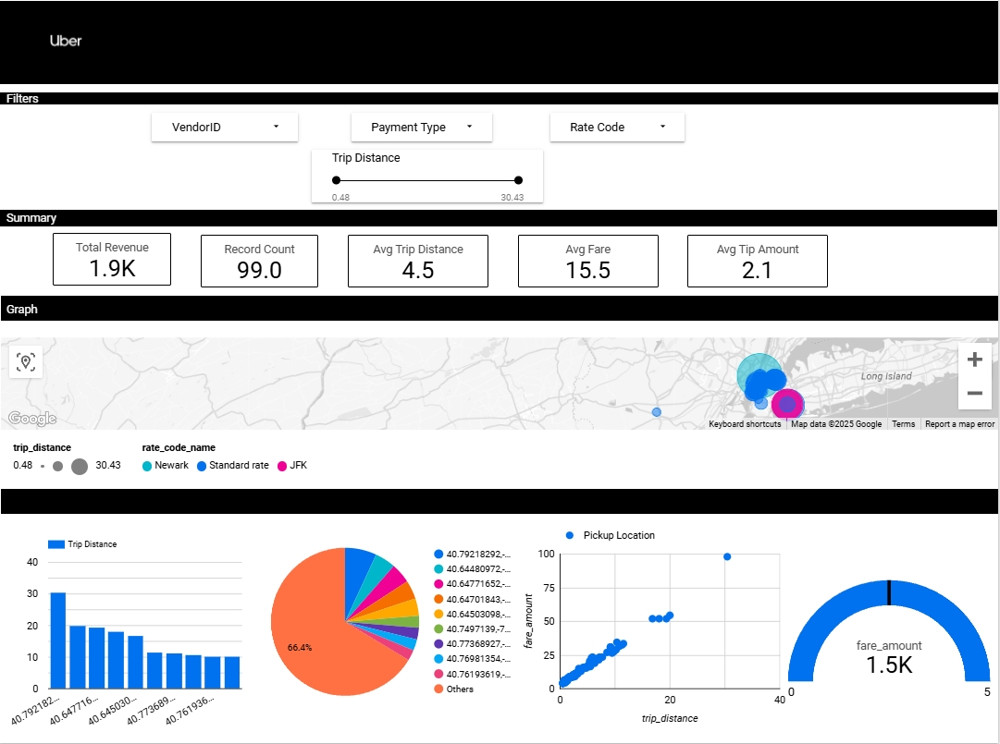

# Uber Data Analytics | Modern Data Engineering GCP Project

## Introduction

This project aims to perform data analytics on Uber data by leveraging modern data engineering tools and technologies. The workflow utilizes Google Cloud Platform (GCP), Python, and Mage Data Pipeline Tool to process and analyze the dataset. The results are visualized using Looker Studio for actionable insights.

## Technology Used

- **Programming Language**: Python
- **Google Cloud Platform (GCP)**:
  - Google Storage
  - Compute Instance
  - BigQuery
  - Looker Studio
- **Modern Data Pipeline Tool**: [Mage AI](https://www.mage.ai/)

Contribute to this open-source project: [Mage AI GitHub Repository](https://github.com/mage-ai/mage-ai)

## Dataset Used

**TLC Trip Record Data**  
This dataset includes yellow and green taxi trip records, capturing various fields such as:

- Pick-up and drop-off dates/times
- Pick-up and drop-off locations
- Trip distances
- Itemized fares
- Rate types
- Payment types
- Driver-reported passenger counts

You can find the dataset used in this project here:

Additional details about the dataset:

- [TLC Trip Record Data Website](https://www.nyc.gov/site/tlc/about/tlc-trip-record-data.page)
- [Data Dictionary](https://www.nyc.gov/assets/tlc/downloads/pdf/data_dictionary_trip_records_yellow.pdf)

## Project Workflow

1. **Data Ingestion**: Load the Uber dataset into Google Storage.
2. **Data Processing**: Utilize Mage AI pipelines to clean, transform, and prepare the data for analysis.
3. **Data Analysis**: Query the transformed data in BigQuery.
4. **Data Visualization**: Create interactive dashboards in Looker Studio to visualize insights.

## Dashboard

## Conclusion

This project demonstrates the power of modern data engineering tools and GCP to build scalable, efficient data analytics pipelines.
